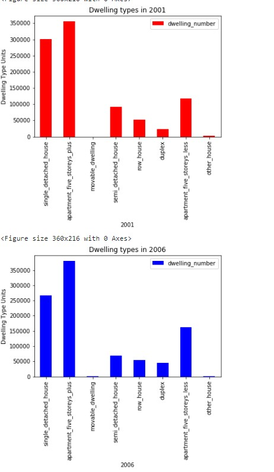
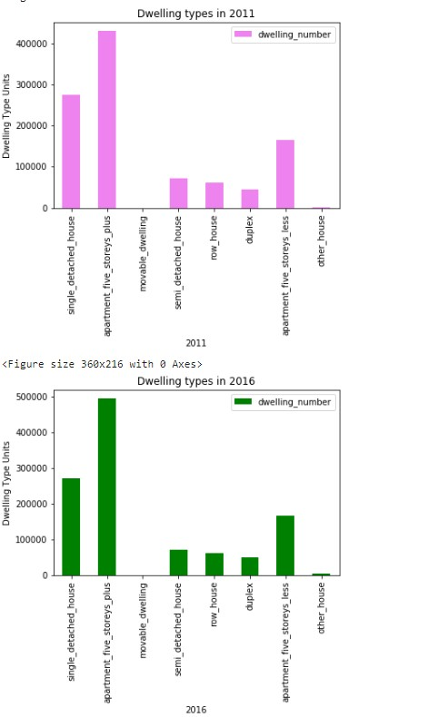
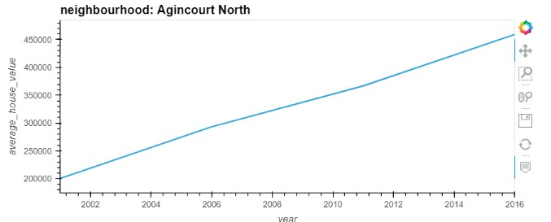
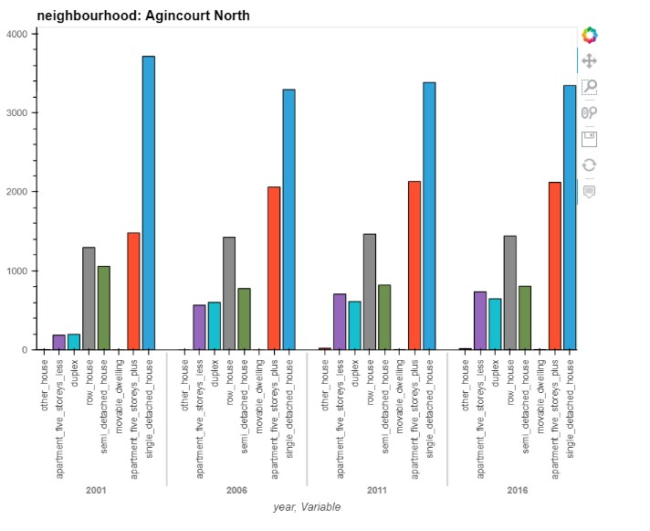
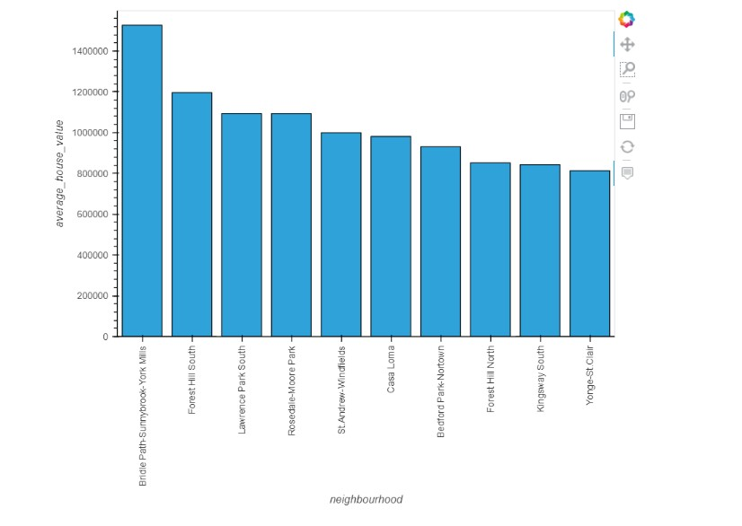

# Rental Analysis : 
### Steps involved :
The first step is to import libraries and dependencies.
The second step in the process of making a dashboard is to retrieve the required data and seggregate it according to what needs to be presented visually and assigning variabes to those seggregates of data.
In this assignment i had to slice the data based on :
1. Dwelling types per year.
2. Average monthly shelter costs in Toronto per year.
3. Average house Value per year.
4. Average prices by neighbourhood.
5. Number of dwelling types per year.
6. Top 10 most expensive Neighbourhoods in Toronto.
The third step is to define functions inorder to avoid repetetions where they can avoided.
These functions can also be used to plot data when called upon.
### Visualisations:
Visualisations used in this assignment are:
1. Line charts.
2. Bar charts.
3. Scattered map.
##### Visualisations based on the sliced data :
1. Dwelling types per year.

2. Average monthly shelter costs in Toronto per year and  Average house Value per year.

3. Average prices by neighbourhood.

4. Number of dwelling types per year.

5. Top 10 most expensive Neighbourhoods in Toronto.

6. Map representation :
[alt text](map.jpg "Scatter Map")
### Dashboard :
And lastly in a sperate file i made a dashboard to assemble all visuallizations for accesing and understanding the data ina better way.
The components involved in making the dashboard are:
1. Tile
2. Welcome Text.
3. Tabs.
[alt text](Dashboard.jpg "Dashboard")
